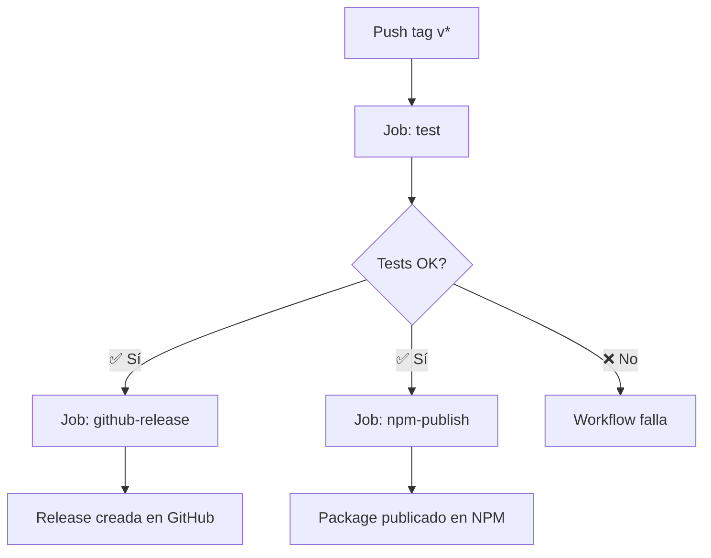

# GitHub Actions - Release & Publish

Este workflow automatiza la publicación de la librería en NPM y la creación de releases en GitHub.

## ⚙️ Configuración

### 1. Primera publicación (manual)

**Para la primera vez**, debes publicar el package manualmente desde tu máquina:

```bash
# 1. Asegúrate de estar logueado en npm
npm login

# 2. Verifica que el build esté limpio
pnpm build

# 3. Publica la primera versión
pnpm publish --access public
```

Esto creará el package `@cristiancosano/pallet-builder` en npm.

### 2. Configurar Trusted Publishing en NPM

**Después de la primera publicación**, configura Trusted Publishing para futuras releases automáticas:

1. Ve a [npmjs.com](https://www.npmjs.com/) e inicia sesión
2. Ve al package `@cristiancosano/pallet-builder` → **Settings**
3. En la sección **Publishing access**, busca **Trusted publishers**
4. Click en **Add trusted publisher**
5. Configura:
   - **Provider**: GitHub Actions
   - **Organization**: `cristiancosano`
   - **Repository**: `pallet-builder`
   - **Workflow**: `release.yml`
   - **Environment**: (déjalo vacío)
6. Click **Add**

✅ **¡Ya está!** Ahora las siguientes publicaciones se harán automáticamente desde GitHub Actions sin necesidad de tokens.

**¿Qué es Trusted Publishing?**

Trusted Publishing usa OpenID Connect (OIDC) para verificar que las publicaciones provienen de tu repositorio de GitHub sin necesidad de tokens. Beneficios:
- ✅ Sin tokens que expiren o rotar
- ✅ Sin secrets que gestionar en GitHub
- ✅ Mayor seguridad (no hay credenciales que comprometer)
- ✅ Provenance automático (attestations firmadas por npm)
- ✅ Compatible con 2FA sin configuración adicional

### 3. Permisos del GITHUB_TOKEN

El workflow ya está configurado con los permisos necesarios:
- `contents: write` para crear releases
- `id-token: write` para autenticación OIDC con npm

## 🚀 Uso

### Primera publicación (v0.1.0)

1. **Publica manualmente la versión inicial**:
   ```bash
   npm login
   pnpm build
   pnpm publish --access public
   ```

2. **Configura Trusted Publishing en npm** (ver sección anterior)

3. **Crea el tag en git**:
   ```bash
   git tag v0.1.0
   git push origin v0.1.0
   ```

### Siguientes releases (automáticas)

Una vez configurado Trusted Publishing, las siguientes releases son completamente automáticas:

### Siguientes releases (automáticas)

Una vez configurado Trusted Publishing, las siguientes releases son completamente automáticas:

1. **Actualiza la versión en package.json**:
   ```bash
   # Para versión patch (bug fixes)
   pnpm version patch
   
   # Para versión minor (nuevas features)
   pnpm version minor
   
   # Para versión major (breaking changes)
   pnpm version major
   ```
   Esto actualiza `package.json` y crea automáticamente un commit y tag

2. **Push del tag al repositorio**:
   ```bash
   git push origin main --tags
   ```

3. **El workflow se ejecutará automáticamente** y:
   - ✅ Ejecutará todos los tests unitarios
   - ✅ Verificará la compilación TypeScript
   - ✅ Creará una release en GitHub (en paralelo)
   - ✅ Publicará el package en npmjs (en paralelo)

## 📋 Flujo del Workflow



## 🔍 Verificación

Después de que el workflow termine exitosamente:

1. **Verifica la release en GitHub**:
   ```
   https://github.com/cristiancosano/pallet-builder/releases
   ```

2. **Verifica la publicación en NPM**:
   ```bash
   npm view @cristiancosano/pallet-builder
   ```

3. **Verifica el provenance (attestation)**:
   ```bash
   npm audit signatures
   ```
   Verás que el package tiene una firma verificable desde GitHub Actions

4. **Prueba la instalación**:
   ```bash
   npm install @cristiancosano/pallet-builder@latest
   ```

## ⚠️ Notas Importantes

- Los tags deben seguir el formato `v*` (ejemplo: `v0.1.0`, `v1.2.3`)
- Si los tests fallan, no se crea la release ni se publica en NPM
- El proyecto usa **pnpm 10.x** — asegúrate de que `pnpm-lock.yaml` esté commiteado
- El comando `pnpm version` actualiza automáticamente el `package.json` y crea un commit y tag
- La publicación usa `--access public` porque es un scoped package
- La publicación usa `--provenance` para generar attestations firmadas de npm
- La release de GitHub se genera automáticamente con las notas del changelog
- **No se necesitan tokens**: Usa Trusted Publishing (OIDC) para máxima seguridad
